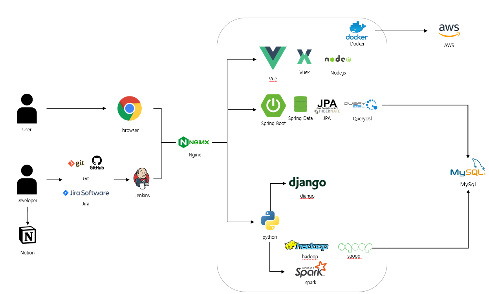

**웹 환경기반으로 제작되었습니다.🌝 추천해상도 (1536 * 864)🖥**

# 🌎 Doyouknow?

**세계 6개국 뉴스데이터들을 통해 한국 관련 키워드를 알아보자!**

>'Do you know BTS?', 'Do you Know Sonny?' 이런 말을 들어본 적이 있으신가요?  
>
>서비스 'Doyouknow?' 는 주요 국가에서의 한국 관련 키워드를 수집하여 
>
>다양한 분석을 통해 보여드립니다. 

### 이제는 물어보지말고 **`Doyouknow?` **에서 알아보세요 !

#### Do you know 'Doyouknow?'

## 📆 개발기간

**2022.08.22 ~ 2022.10.07**

## 👨‍👨‍👧 팀원소개

**대전 2반 8팀**

- 김우빈[BE] : 팀장
- 송선아[BE] : 팀원
- 이기진[BE] : 팀원
- 배건길[FE] : 팀원
- 박호현[FE] : 팀원
- 최준혁[FE] : 팀원

## 🌠기술스텍

|      Frontend       |       Backend        |      DB      |     Data     |  CI/CD  |      IDE      |
| :-----------------: | :------------------: | :----------: | :----------: | :-----: | :-----------: |
|     Vue 3.2.13      |         Java         | MySQL 8.0.29 | Hadoop 3.2.2 | AWS EC2 | IntelliJ IDEA |
|  Vue-router 4.0.3   |     Spring Boot      |   sqlLite    |    Spark     | Docker  |    VScode     |
|     Vuex 4.0.2      |   Spring Data JPA    |              |    mecab     | Jenkins | VMWare 16.2.4 |
|   Node.js 16.16.0   |       swagger        |              |    sqoop     |  NGINX  |               |
|  Three.js 0.144.0   |        Python        |              |              |   SSL   |               |
|    char.js 4.1.2    |        Django        |              |              |         |               |
| vue-wordcloud 1.0.2 | Django rest framwork |              |              |         |               |

## 🏛 아키텍쳐

## 📌 주요기능

#### 1. Main

>🚀구현기술 : 3D디자인, 스크롤 이벤트, 라우터를 통한 페이지전환
>
>😀특장점 
>
>- three.js를 활용한 3D modeling 구현과 이벤트를 통한 데이터랩 전환
>-  swiper.js를 통한 메인페이지 full scroll 이벤트 구현

- `Datalab` : 세계 6개국의 Google News들을 모아 한국 관련 키워드들을 데이터랩으로 제공

- `DYKClub` : 명예 키워드들을 한곳에 모은 한국판 명예의전당
- `Game` : 세계가 바라보는 한국의 키워드들을 이용한 더많이더적게 게임

#### 2. Datalab

**세계 6개국 Google News 크롤링을 통해 대한민국 관련 데이터들을 한눈에 알아보자!!**

>🚀구현기술 : 6개국에서 가장인기있는 한국 키워드를 카테고리별, 기간별 / 다양한차트를 통해 제공
>
>😀특장점 
>
>- chart.js를 통해 동적인 애니메이션이 포함된 해상도 높은 데이터 시각화 구현
>- Mecab을 통해 만든 알고리즘을 활용해 형태소분석
>- Hadoop Sqoop을 활용해 HDFS-Mysql간의 데이터 교환으로 인한 자동화 기반 구현
>- Spark를 활용한 감정분석으로 긍정적인 트윗 반응만 수집
>- 쉘 스크립트 스케쥴링을 통한 데이터수집/가공/저장 자동화 구현
>
>✨핵심기술
>
>- Hadoop MapReduce를 활용한 워드카운팅 구현
>- bs4를 활용한 크롤링 기법으로 빅데이터 형성

- 메인페이지에서 국가위치의 열기구를 클릭하면 해당 국가 데이터랩이 오버레이됩니다. 

  (마우스 호버시 해당 국가 국기를 보여주니까 걱정말라구)

- `총데이터`  : 해당 국가의 Google News에서 크롤링한 총 데이터 수를 나타냅니다. 

  (%는 해당국가 데이터/전체데이터)

- `키워드랭크` : 카테고리와 기간을 선택하면 키워드 순위와 도넛차트를 보여줍니다.

  **키워드 클릭시 !**

- `날짜별검색량` : 키워드의 수집량을 일자별로 확인할수 있습니다.  

- `연관검색어` : 키워드의 연관검색어들을 확인할 수 있습니다.

- `관련뉴스` :  키워드와의 관련뉴스를 제공해준답니다.

- ✨ `Doyouknow??` : 저희의 마스코트인 **국본이**를 클릭하면 해당 키워드를 국가언어로 알려줍니다.

  (ex. 영국 BTS 클릭시 "Do you know BTS?" )

#### 3. DYKClub

**한국의 위상을 빛낸 키워드들이 한 곳에! DoYouKnowClub**

> 🚀구현기술 : 두유노클럽 가입자 정보확인, 실시간 트윗반응 확인, 영상 인트로 페이지/배경

- `youtube` : 명예키워드들의 위상을 유튜브 시청제공합니다.
- `twitter` : 명예키워드들의 **전세계 트위터 반응**을 확인(**번역기능**이 있으니 안심하라구)
- `intro` : 기본 정보를 제공합니다.
-  `award` : 명예키워드들의 살아생전의 업적을 확인합니다.

#### 4. Game

**세계 뉴스속 한국 관련 키워드들의 수집량을 게임을 통해 비교해보자 !**

>🚀구현기술 : 자체 수집된 빅데이터 기준 승패결정, 데이터랜더링, 게임승패이벤트

- 주어진 키워드 중에 어떤 키워드의 검색량이 높을까??!  저희가 수집한 3개월간 세계 Google News 데이터를 통해 간단한 게임을 해봅시다.
- 높다고 생각하면 **더많이**, 적다고 생각하면 **더적게** 버튼을 클릭
- 틀렸을 경우, 합계 점수와 함께 게임이 종료됩니다.

## 📖 문서

#### [📑Notion](https://www.notion.so/8-d1f1350d842a4968b920596ea5742efe)

- 기능명세서
- API 명세서
- ERD Cloud
- 데이터크롤링 메뉴얼
- 중간발표자료
- 최종발표자료

#### [🎨Figma](https://www.figma.com/file/AEjAWkCo4s6JkpJhKb8XqZ/Untitled?node-id=0%3A1)

- 와이어프레임
- 컬러팔레트

#### [🎞UCC]()